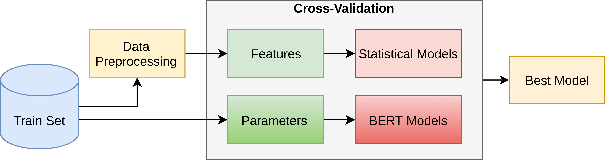

# AI-UPV at IberLEF-2021 DETOXIS task: Toxicity Detection in Immigration-Related Web News Comments Using Transformers and Statistical Models



# Description:
This repository contains the code for the paper **AI-UPV at IberLEF-2021 DETOXIS task: Toxicity Detection in Immigration-Related Web News Comments Using Transformers and Statistical Models**. This paper was be published at the [SEPLN-WS-IberLEF 2021](http://ceur-ws.org/Vol-2943/
) ([the 3rd Workshop on Iberian Languages Evaluation Forum](https://sites.google.com/view/iberlef2021) at [the SEPLN 2021 Conference](https://www.hitz.eus/sepln2021/)) scientific event. Descriptions of the implementation and the dataset are contained in the [paper](http://ceur-ws.org/Vol-2943/detoxis_paper2.pdf).

# Paper Abstract:
This paper describes our participation in the DEtection of TOXicity in comments In Spanish (DETOXIS) shared task 2021 at the 3rd Workshop on Iberian Languages Evaluation Forum. The shared task is divided into two related classification tasks: (i) Task 1: toxicity detection and; (ii) Task 2: toxicity level detection. They focus on the xenophobic problem exacerbated by the spread of toxic comments posted in different online news articles related to immigration. One of the necessary efforts towards mitigating this problem is to detect toxicity in the comments. Our main objective was to implement an accurate model to detect xenophobia in comments about web news articles within the DETOXIS shared task 2021, based on the competition's official metrics: the F1-score for Task 1 and the Closeness Evaluation Metric (CEM) for Task 2. To solve the tasks, we worked with two types of machine learning models: (i) statistical models and (ii) Deep Bidirectional Transformers for Language Understanding (BERT) models. We obtained our best results in both tasks using BETO, a BERT model trained on a big Spanish corpus. We obtained the 3rd place in Task 1 official ranking with the F1-score of 0.5996, and we achieved the 6th place in Task 2 official ranking with the CEM of 0.7142. Our results suggest: (i) BERT models obtain better results than statistical models for toxicity detection in text comments; (ii) Monolingual BERT models have an advantage over multilingual BERT models in toxicity detection in text comments in their pre-trained language.

# Cite
If you find this [article](http://ceur-ws.org/Vol-2943/detoxis_paper2.pdf) or the [code](https://github.com/AngelFelipeMP/Machine-Learning-Tweets-Classification) useful in your research, please cite us as:

```
@article{depaula2021detoxis,
  title={AI-UPV at IberLEF-2021 DETOXIS task: Toxicity Detection in Immigration-Related Web News Comments Using Transformers and Statistical Models},
  author={Magnoss{\~a}o de Paula, Angel Felipe and da Silva, Roberto Fray and Schlicht, Ipek Baris},
  booktitle={Proceedings of the Iberian Languages Evaluation Forum (IberLEF 2021) co-located with the Conference of the Spanish Society for Natural Language Processing (SEPLN 2021), XXXVII International Conference of the Spanish Society for Natural Language Processing.,  Málaga, Spain},
  volume={2943},
  pages={547-566},
  year={2021}
}
```

# Credits
DETOXIS 2021 shared Task Organizers

DETOXIS 2021 proceedings: http://ceur-ws.org/Vol-2943/

Task website: https://detoxisiberlef.wixsite.com/website/task

Contact: detoxis.iberlef@gmail.com
<!--stackedit_data:
eyJoaXN0b3J5IjpbLTU5ODE0NjkzOCwtNTIzNTI0NTcwLDkxMj
Y0NDMzNSwtMTgxMjQ4ODM5MywtMTM2NDA3MTI4NCw1MTMyNjgy
NTUsLTE2Mzc4MTg0MzksNzkwMDg4NDQyLC0yMDk2MjMxODk2XX
0=
-->
